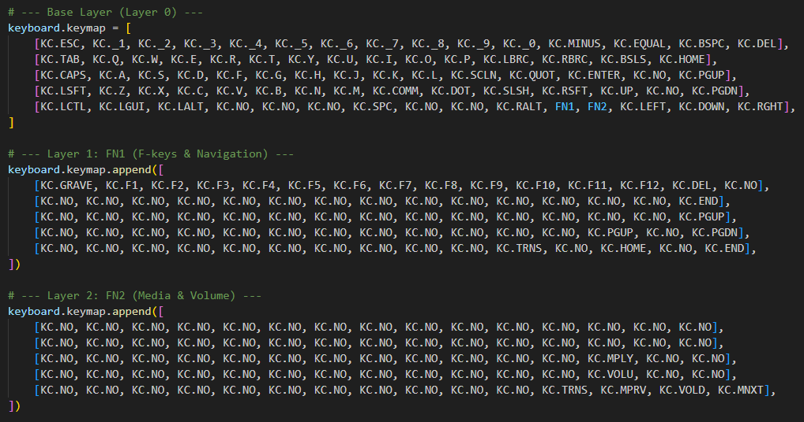

# Journal
## Total time: 28.5 hours
## Day 1 - 3.5 hours
Today I spent a lot of time brainstorming and collecting information, I considered tons of projects ideas and read through a bunch of posts on highway-pitstop to get a sense of what people were doing.

https://hc-cdn.hel1.your-objectstorage.com/s/v3/6bdc2a9380d74c3753306195ba76cc8d3eada37c_day1.mp4

## Day 2 - 2 hours
I continued researching, including discussing some ideas with my friends on slack (like my Apex team), I added a few ideas to get the full list and then I began narrowing down the project list.

## Day 3 - 1.5 hours
After many days of pondering, today I finally narrowed my ideas down to four projects: an autonomous drone fleet, a multi material system for my prusa 3d printer (currently I manually swap), a custom keyboard, and a cnc machine for my robotics team. I settled on the custom keyboard because of a key experience. I had two of my friends over to my house today, and using some spare key switches, diodes, and xiaos I had laying around, I taught them how to solder by assembling the extra pcbs I had (since JLCPCB ships in sets of 5). It was really fun, and I wanted a project that we could continue having fun with, while making something actually useful. Although I still really like the other project ideas, I want to build up my skills first and they seem very complicated. Also, the lack of customization on my current keyboard has been annoying me a lot.

## Day 4 - 4 hours
With my idea finally set, I first developed my knowledge. In the hackpad website, there was a really good video on creating keyboards in KiCAD that I watched. Then, I went through a few other videos (quick totrials, tips, and design best practices) while practicing what I learned in Fusion360 and KiCAD. The image is of one of the practice pieces I made.

## Day 5 - 1.5 hours
I took apart my keyboard to see what it looked like on the inside and get design ideas. Then I used that context to lay out my plan for the layout, features, and basic components.

## Day 6 - 2.5 hours
I created the basic schematic in KiCAD (just the keys, diodes, and mcu). At first, I was struggling a lot wire up so many keys and diodes and it became a mess. So, I restarted and by using labels for rows/columns instead of direct connections, and careful placement of everything in exact grids it turned out well. Also, I began creating the 65% layout I had decided on in the PCB editor.

## Day 7 - 2 hours
After resting after undericty for a few days (and catching up on sleep), I continued to create the layout. However even after an hour of laying out the switch footprints, I was unhappy with the result. It was impossible to get them perfect especially with KiCADs annoying system. So, I researched online and reached out to people on Slack. One of my friends showed me a plugin that could automatically arrange the keys that was extremely helpful. The documentation was really confusing though so it took me a while to get it working.

## Day 8 - 3 hours
Now that I had the layout done, it was relatively straightforward to wire everything. Once I had that done I wanted to figure out the 3D viewer. A lot of my components were missing a 3D model so I found models online (SnapMagic was very helpful for this). However, I realized it wasn't very straightforward to change all of them. Since I had a lot of keys I had to learn how to use the footprint library editor to make changes to all of them instead of one-by-one. Also I realized that my diodes might get in the way on the top of the board so I moved them to the back to be safe.

## Day 9 - 2.5 hours
I tried bringing the STEP model from KiCAD into Fusion360 but I realized I forgot to assign custom 3D models for my larger keys (like spacebar) so I went back and fixed that. While I was at it I went into a bit of a rabbit hole with silkscreen, and added up creating and adding two custom logos and two qr codes (one for my personal website and one for this repository). Also I wanted to add some functionality to the keyboard and I realized I had literally the exact amount of GPIO pins left to add two rotary encoders, so I did that. Also I made some mistakes trying to fix errors from the DRC because for some reason it was complaining that the ground pins on my MCU weren't connected to each other even though they don't need to be. Luckily I had saved earlier so no harm was done and I just ignore the error now.

## Day 10 - 1.5 hours
I started working on the case in Fusion360. While I was using the keyboard-layout-editor that I learned about from hackpad, I realized that the default 65% keys to the right of spacebar were pretty unecessary for me and I could replace them with two function keys. This gave me the idea to have two extra layers that just required holding Fn and then another buttong (kinda like Ctrl). I got a bit sidetracked planning out those two layers, but eventually I got back to CADing and finished the rough case design for the bottom piece.

## Day 11 - 2.5 hours
I created the top of the case design and then made an assembly of everything. It looked great so I went back and added finishing touches like tolerances, fillets, and chamfers. Then I finished writing the code for it in KMK. The FN1 key will toggles Fn1-12 keys and some navigations keys like End that don't fit on my first layer (since it's a 65% layout). The FN2 key will toggle media controls. It didn't take too long to write, but I'm sure that, like with the hackpad I'm going to have to do a lot of debugging once I build the board and nothing works :).

## Day 12 - 2 hours
Today was fun, I got to wrap everything up. I made a few minor changes but mostly everything was good so I made the BOM and started collecting final pictures for the README. Making the BOM for a keyboard was a lot of fun because although some components like diodes are standard, there is a ton of variety for key switches and keycaps. I talked to some of my keyboard enthusiast friends for recommendations and read through reddit, forums, and discord servers. Then after a ton of researching (browsing and window shopping) I submitted the project. 
