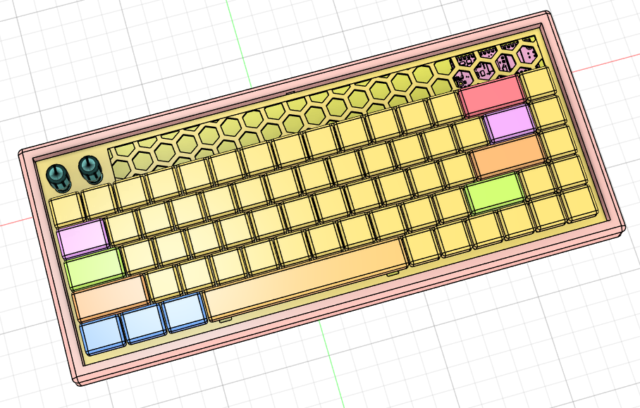
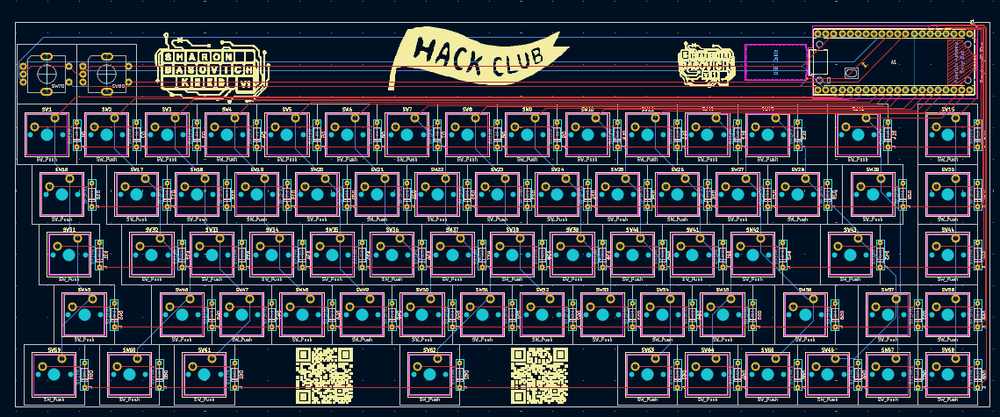
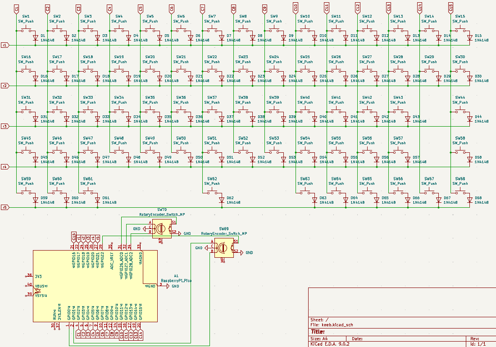

# Sharon's Keeb

A custom 65% keyboard with two knobs and two function layers to maximize my productivity.

## Why did I make this?

Apart from improving at CAD, KiCAD, programming, and soldering, my goal with this project was to make a keyboard that matched my preferences (such as two knobs) and could be made with readily available components. It uses standard switches, diodes, and encoders. Also, everything is THT which means I can use it to teach my friends soldering (like I did with my extra hackpad PCBs).

## Layers
### The FN1 key toggles to  a F1-12 and navigation layer
### The FN2 key toggles to a media control layer

# Key Matrix Table
### Rotary Encoder #1: Volume Up/Down and Play/Pause
### Rotary Encoder #2: Zoom In/Out and Win + Shift + S (Snipping Tool)

| Row | C1   | C2   | C3   | C4 | C5 | C6 | C7    | C8 | C9 | C10  | C11 | C12  | C13   | C14  | C15  |
| --- | ---- | ---- | ---- | -- | -- | -- | ----- | -- | -- | ---- | --- | ---- | ----- | ---- | ---- |
| R1  | ESC  | 1    | 2    | 3  | 4  | 5  | 6     | 7  | 8  | 9    | 0   | -    | =     | BSPC | DEL  |
| R2  | TAB  | Q    | W    | E  | R  | T  | Y     | U  | I  | O    | P   | \[   | ]     | BSLS | HOME |
| R3  | CAPS | A    | S    | D  | F  | G  | H     | J  | K  | L    | ;   | '    | ENTER | N/A   | PGUP |
| R4  | LSFT | Z    | X    | C  | V  | B  | N     | M  | ,  | .    | /   | RSFT | UP    | N/A   | PGDN |
| R5  | LCTL | LGUI | LALT | N/A | N/A | N/A | SPACE | N/A | N/A | RALT | FN1 | FN2  | LEFT  | DOWN | RGHT |

# Bill of Materials

| Item                                | Quantity | Link                                                                                       | Price |
|-------------------------------------|----------|--------------------------------------------------------------------------------------------|-------|
| Raspberry Pi Pico                   | 1        | https://amazon.com/dp/B09KVB8LVR                                                           | 8.14  |
| Key Switches (JWICK Ultimate Black) | 68       | https://www.amazon.com/Ultimate-Switch-Switches-Mechanical-Keyboard/dp/B0C391QDFB/?th=1    | 19.99 |
| 1N4148 Diodes                       | 68       | https://www.amazon.com/McIgIcM-1n4148-switching-Standard-Through/dp/B06XB1R2NK/            | 4.99  |
| EC11 Rotary Encoder                 | 2        | https://www.amazon.com/Original-Rotary-Encoder-Digital-Potentiometer/dp/B07VP4847G/        | 3.10  |
| Keycaps                             | 68       | https://www.amazon.ca/Keycaps-Doubleshot-Switches-Mechanical-Keyboard/dp/B0D6QXTZT4/       | 35.99 |
| Stabilizers                         | 5        | https://www.amazon.com/DUROCK-Stabilizer-Innovative-Pre-clipped-Stabilizers/dp/B0D4QF6TGB/ | 9.99  |
| PCB                                 | 1        | https://jlcpcb.com/                                                                        | 24.30 |
| Case Bottom                         | 1        | None, 3DP at home                                                                          |       |
| Case Top                            | 1        | None, 3DP at home                                                                          |       |

